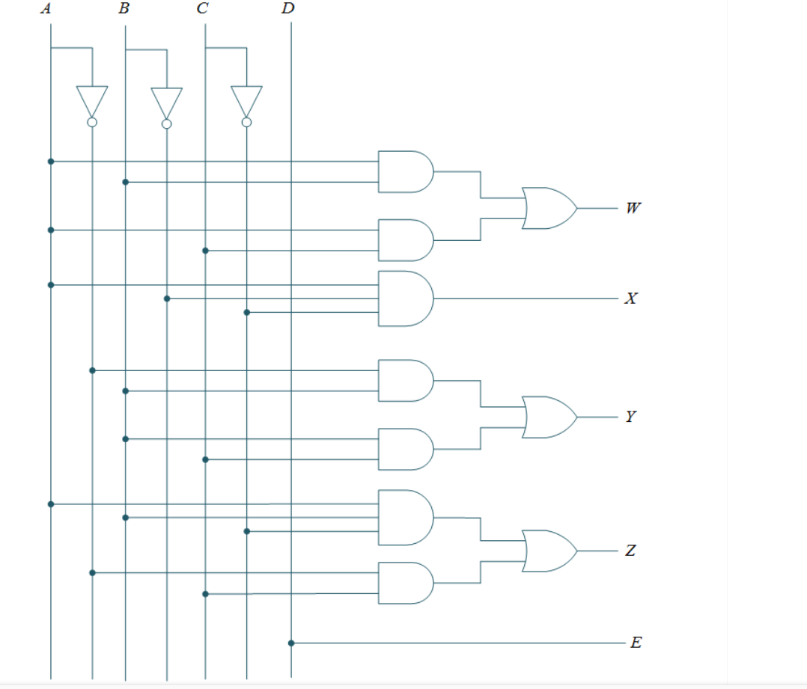
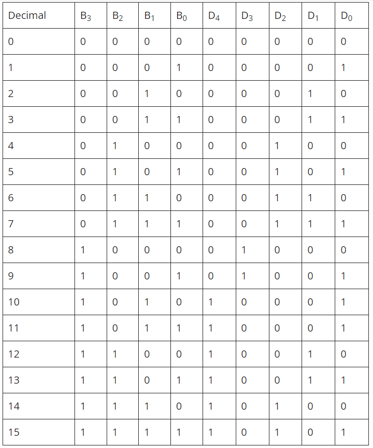
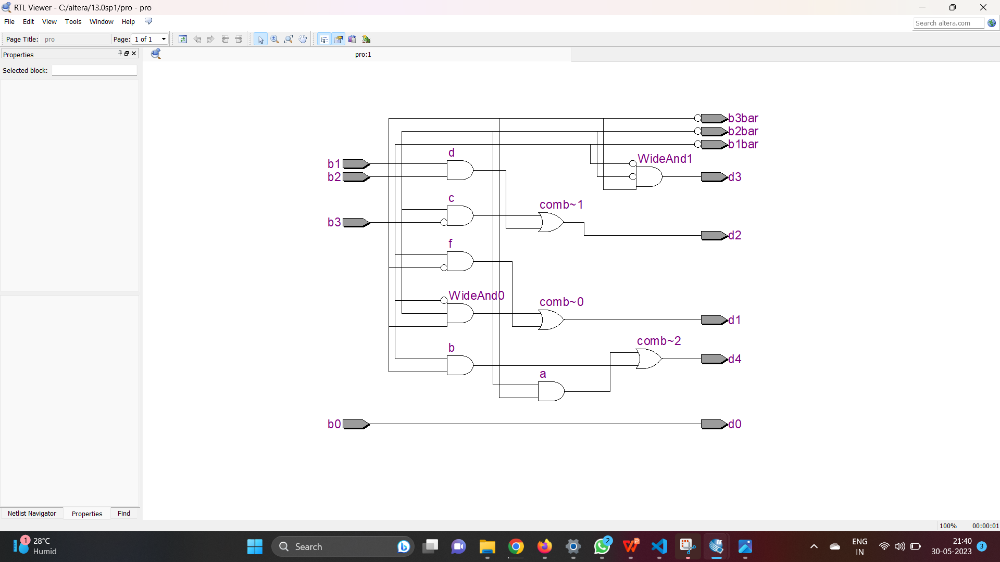
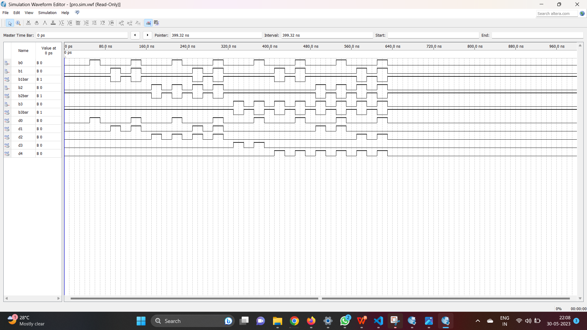

# TITLE:
Design a 4 bit binary to BCD converter using verilog.

# THEORY:
BCD stands for binary coded decimal, in this each decimal digit is represented by a 4 bit binary. There is 10 distinct decimal digit in decimal number system which starts from 0 to 9.

In the 4 bit binary to BCD code converter, since the input is 4- bit binary so there is 16 possible combinations. From 10 to 15 decimal numbers, since we cannot represent these numbers by 4 bit BCD code, so we need 8 bit to represent such 2 digit decimal number.

But the first 3 bits are zero. Therefore, we can ignore the first 3 bit and we are going to use remaining 5 bits to represent such number in BCD code. 
For example, the decimal number 11 is represented into BCD code like this 10001 which is 1011 in binary form. The actual BCD code of 11 is 00010001, here, the first 3 bits are ignored and taken only the 5 bits.

For 10 to 15 decimal numbers converted into BCD code form, the 5th bit [MSD] is always taken 1 and remaining bits [LSD] are just copy of binary code of respective numbers, such as 2 is 0010 in binary code form and 12 is 10010 in BCD code form and so on.

# LOGIC DIAGRAM:


# PROCEDURE:
1.Create a project with required entities.

2.Create a module along with respective file name.

3.Run the respective programs for the given boolean equations.

4.Run the module and get the respective RTL outputs.

5.Create university program(VWF) for getting timing diagram.

6.Give the respective inputs for timing diagram and obtain the results.

# PROGRAM:
```
#DEVELOPED BY : Akshayaa M
#REGISTER NUMBER: 212222230009
module pro(b0,b1,b2,b3,b1bar,b2bar,b3bar,d0,d1,d2,d3,d4);
input b0,b1,b2,b3;
output b1bar,b2bar,b3bar,d0,d1,d2,d3,d4;
wire a,b,c,d,e,f;
assign d0=b0;
not(b1bar,b1);
not(b2bar,b2);
not(b3bar,b3);
and(a,b3,b2);
and(b,b3,b1);
and(c,b3bar,b2);
and(d,b2,b1);
and(e,b3,b2,b1bar);
and(f,b3bar,b1);
and(d3,b3,b2bar,b1bar);
or(d1,e,f);
or(d2,c,d);
or(d4,a,b);
endmodule

```
# TRUTH TABLE:

# NETLIST DIAGRAM:

# TIMING DIAGRAM:

# RESULT:
Hence a 4 bit Binary to BCD converter using Verilog has been designed and stimulated.
# REFERENCE:
https://www.alltechsub.com/4-bit-binary-to-bcd-code-converter/#:~:text=In%20the%204%20bit%20binary,first%203%20bits%20are%20zero.
